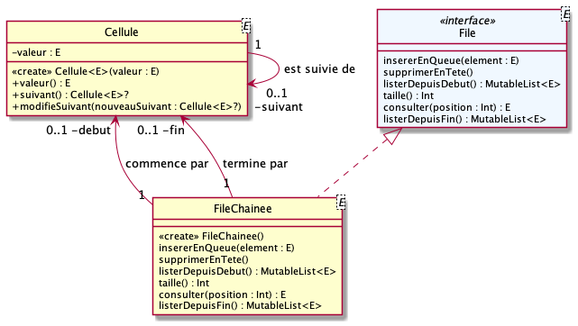
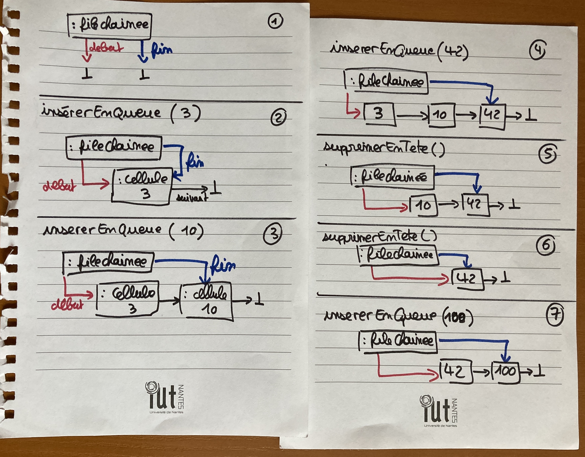

# qdev.dp.tp1

## Tests Junit

Des fichiers de tests Junit vous sont fournis ; utilisez les pour valider votre développement au fur et à mesure.

Renommez au-fur-et-à-mesure les fichiers  `.ktest` en `.kt` pour les inclure dans les fichiers à tester.

## Travail à réaliser

### question n°1

__NB : cet exercice faisait partie du dernier test machine de _but1.dev.objets___

L'interface `File<E>` documente toutes les méthodes à implémenter.

La classe `Cellule<E>` est fournie.

Implémentez une file chainée `FileChainee<E>` comme décrite
par le diagramme de classes suivant :

Le fonctionnement attendu de la file chainée est illustré par les schémas suivants :

### question n°2

Proposez dans `FileArrayList<E>` une **autre** implémentation de l'interface `File<E>` utilisant cette fois sur une collection de type `ArrayList<E>`.

__NB :__ modifiez les cas de tests `TestUsage***.kt` pour tester cette nouvelle implémentation ; réfléchissez à limiter **au maximum** les modifications

### question n°3

Ecrivez un programme permettant de "comparer" les deux implémentations proposées pour la `File<E>`. 

Réfléchissez à ce que peut signifier "comparer" ?

**NB :** 

- Vous pouvez générer des données aléatoires. 
- Vous pouvez également "lire des mots" dans les fichiers texte présents dans `data/`.

### question n°4 (subsidiaire)

C'est à peine la rentrée ; certain(e)s d'entre vous ont peut-être été coincé encore récemment dans un bouchon à un péage.

Modéliser puis implémenter le comportement d'un péage autoroutier de "n" portiques de péage accueillant différents véhicules.

Vous pourrez "simuler" les différents événements : arrivée d'un nouveau véhicule, choix d'un portique, passage d'un véhicule à un portique, etc.

### question n°5 (subsidiaire)

Modifiez votre implémentation de  `FileChainee<E>` pour utiliser maintenant une liste doublement chainée : c-à-d que `Cellule<E>` connait maintenant sont prédécesseur en plus de son suivant.
Qu'est-ce que cela change pour `FileChainee<E>` ?
